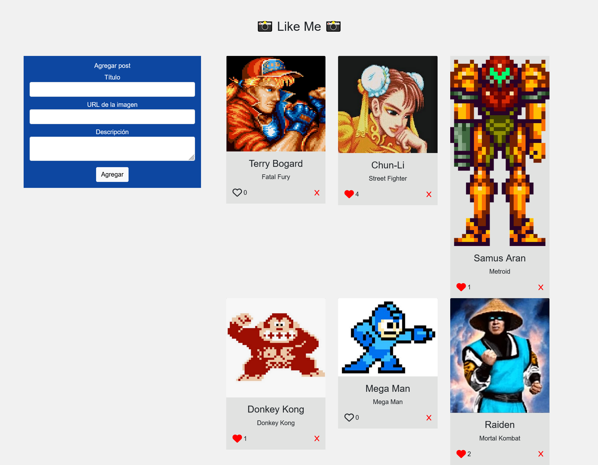
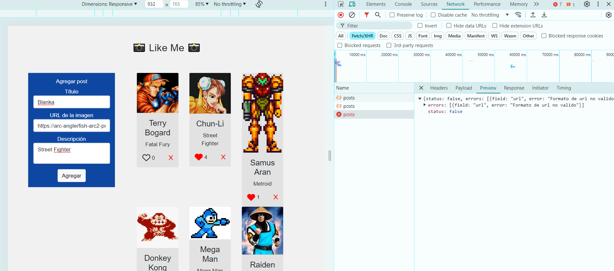

# Desafío - Like Me (Parte II) ❤️

En este desafío, he extendido la aplicación backend de la red social "Like Me" para permitir la interacción de likes y la eliminación de posts utilizando Node.js, Express y PostgreSQL.

## Descripción 📋

La red social "Like Me" sigue desarrollando su plataforma y ahora necesita permitir la interacción de likes y la eliminación de posts. Este desafío extiende la lógica de creación de posts para incluir la capacidad de dar likes y eliminar posts almacenados en una base de datos PostgreSQL.

### Captura de pantalla 📸





### Archivos del Proyecto 📂

- **app.js**: Archivo principal del servidor que gestiona las rutas y las operaciones CRUD.
- **posts.models.js**: Módulo que contiene las funciones para interactuar con la base de datos PostgreSQL.
- **db_connect.js**: Archivo que configura y maneja la conexión a la base de datos.
- **errors.js**: Archivo que contiene la lógica de validación de campos.
- **.env.example**: Archivo de ejemplo para las variables de entorno.
- **package.json**: Archivo que define las dependencias del proyecto.
- **ddl.sql**: Script SQL para crear la base de datos y la tabla de posts.

### Funcionalidades 🔧

- **Agregar Like**: Permite incrementar el número de likes de un post.
- **Eliminar Post**: Permite eliminar un post de la base de datos.

## Requerimientos del Desafío 🎯

1. Agregar una ruta PUT en una API REST y utilizarla para modificar registros en una tabla alojada en PostgreSQL (4 puntos).
2. Agregar una ruta DELETE en una API REST y utilizarla para eliminar registros en una tabla alojada en PostgreSQL (4 puntos).
3. Capturar los posibles errores en una consulta SQL realizada con el paquete pg usando la sentencia try catch (2 puntos).

## Uso de la Aplicación 🚀

### Instalación

Para instalar las dependencias y ejecutar la aplicación, utiliza los siguientes comandos:

```bash
npm install
npm run dev
```

### Endpoints

- GET /posts: Devuelve un JSON con los posts registrados.
- POST /posts: Recibe los datos de un nuevo post y lo agrega a la base de datos.
- PUT /posts/like/:id: Incrementa el número de likes de un post.
- DELETE /posts/:id: Elimina un post de la base de datos por su ID.

## Código 🧩

### app.js

```javascript
import express from 'express'
import cors from 'cors'

import { findAll, create, updateLikeById, deleteById } from './models/posts.models.js'
import { validateFields } from '../utils/errors.js'

const app = express()
const PORT = process.env.PORT ?? 3000

app.use(cors())
app.use(express.json())

app.get('/posts', async (req, res) => {
  try {
    const result = await findAll()
    res.status(200).json(result)
  } catch (error) {
    res.status(500).json({ status: false, message: `Ha ocurrido un error, codigo: ${error.message.code}` })
  }
})

app.post('/posts', async (req, res) => {
  try {
    const { titulo, url, descripcion } = req.body

    const errors = validateFields({ titulo, url, descripcion });

    if (errors.length > 0) {
      return res.status(400).json({ status: false, errors });
    }

    const result = await create(titulo, url, descripcion)
    res.status(201).json(result)
  } catch (error) {
    res.status(500).json({status: false, message: `Ha ocurrido un error, codigo: ${error.message.code}` })
  }
})

app.put('/posts/like/:id', async (req, res) => {
  try {
    const { id } = req.params
    const result = await updateLikeById(id)
    res.status(200).json('Like actualizado')
  } catch (error) {
    res.status(500).json({ status: false, message: `Ha ocurrido un error, codigo: ${error.message.code}` })
  }
})

app.delete('/posts/:id', async (req, res) => {
  try {
    const { id } = req.params
    const result = await deleteById(id)
    res.status(200).json(result)
  } catch (error) {
    res.status(500).json({ status: false, message: `Ha ocurrido un error, codigo: ${error.message.code}` })
  }
})

app.all('*', (req, res) => res.status(404).json({ status: true, message: 'Endpoint no encontrado' }))

app.listen(PORT, () => { console.log(`Servidor funcionando en puerto: ${PORT}`) })
```

### posts.models.js

```javascript
import db from '../database/db_connect.js'

export const findAll = async () => await db('SELECT * FROM posts ORDER BY id ASC')

export const create = async (titulo, url, descripcion) =>
  await db('INSERT INTO posts (titulo, img, descripcion, likes) VALUES ($1, $2, $3, 0) RETURNING *;', [titulo, url, descripcion])

export const updateLikeById = async (id) =>
  await db('UPDATE posts SET likes = likes + 1 WHERE id = $1 RETURNING *;', [id])

export const deleteById = async (id) =>
  await db('DELETE FROM posts WHERE id = $1 RETURNING *;', [id])
```

### db_connect.js

```javascript
import pg from 'pg'

const { Pool } = pg

const config = {
  user: process.env.DB_USER,
  password: process.env.DB_PASSWORD,
  host: process.env.DB_HOST,
  port: process.env.DB_PORT,
  database: process.env.DB_DATABASE,
  allowExitOnIdle: true
}

const pool = new Pool(config)

const db = async (query, values) => {
  try {
    const result = await pool.query(query, values)
    return result.rows
  } catch (error) {
    console.error('[db_connect] => db:', error)
    const newError = { status: false, message: error }
    throw newError
  }
}

export default db
```

### errors.js

```javascript
export const validateFields = ({ titulo, url, descripcion }) => {
    const errors = []
    const imageUrlRegex = /^(http(s?):)([/|.|\w|\s|-])*\.(?:jpg|gif|png|jpeg|bmp|webp|svg|ico|tiff|tif|heic|heif)$/i;

   if (!titulo || titulo.trim() === '') {
        errors.push({field: 'titulo', error: 'Campo requerido'})
    }

    if (!url || url.trim() === '') {
        errors.push({field: 'url', error: 'Campo requerido'})
    } else if (!imageUrlRegex.test(url)){
        errors.push({field: 'url', error: 'Formato de url no valido'})
    }

    if (!descripcion || descripcion.trim() === '') {
        errors.push({field: 'descripcion', error: 'Campo requerido'})
    }

    return errors
}
```

## Tecnologías Utilizadas 💻

- Node.js
- Express.js
- PostgreSQL
- File System (fs)
- CORS

## Mejoras Futuras 🚀

Para futuras iteraciones, planeo:

- Implementar autenticación y autorización.
- Mejorar la interfaz de usuario.
- Añadir validaciones más robustas para los datos de entrada.
- Implementar más funcionalidades de interacción en los posts.
